# ourPlace — Architectural & Technical Diagrams Specification
> **Document Version:** 1.3.0  
> **Last Updated:** 2026-09-18  
> **Target Application:** Privacy-First Anonymous Multi-User Messaging Application with Couple Subsystem (`ourPlace`)  
> **Companion Document:** [`docts.md`](file:///e:/ourPlace/docts.md)

---

## Table of Contents
1. [High-Level System Topology & Privacy Boundary](#1-high-level-system-topology--privacy-boundary)
2. [Three-Tier Credential Separation Model](#2-three-tier-credential-separation-model)
3. [App Launch & Authentication Gate State Machine](#3-app-launch--authentication-gate-state-machine)
4. [App Lifecycle & Background Auto-Lock Flow](#4-app-lifecycle--background-auto-lock-flow)
5. [Clean Architecture Layer Dependencies](#5-clean-architecture-layer-dependencies)
6. [End-to-End Encryption & Ephemeral Relay Protocol](#6-end-to-end-encryption--ephemeral-relay-protocol)
7. [Multi-User Navigation & Screen Hierarchy](#7-multi-user-navigation--screen-hierarchy)
8. [Love Connection & One-Time Love Code Sharing Flow](#8-love-connection--one-time-love-code-sharing-flow)
9. [Local Database Schema & Entity Relationships](#9-local-database-schema--entity-relationships)
10. [Security Enclave & Cryptographic Trust Boundaries](#10-security-enclave--cryptographic-trust-boundaries)
11. [Message State Lifecycle & Synchronization Flow](#11-message-state-lifecycle--synchronization-flow)

---

## 1. High-Level System Topology & Privacy Boundary

The core philosophy of `ourPlace` is:
> *"The phones own the conversation. The server only helps the phones communicate."*

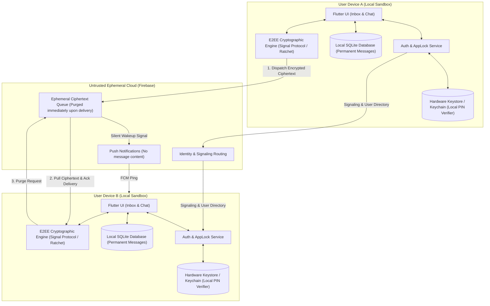

---

## 2. Three-Tier Credential Separation Model

`ourPlace` enforces strict isolation between account authentication, local device security, and ephemeral love sharing:

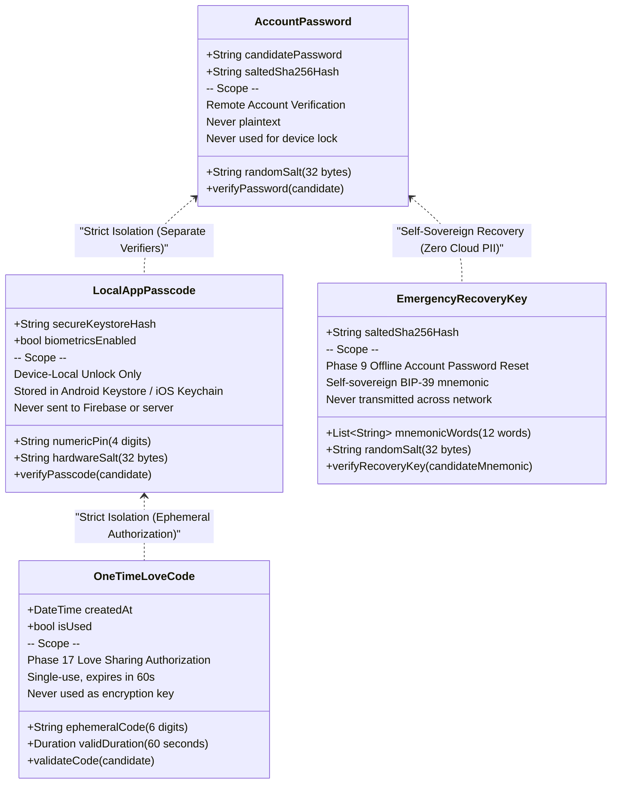

---

## 3. App Launch & Authentication Gate State Machine

Upon launch, [`AuthGate`](file:///e:/ourPlace/chatbox/lib/screens/auth/auth_gate.dart) evaluates account session and local device security state:

```mermaid
stateDiagram-v2
    [*] --> AppLaunch: Application Cold Start

    state AppLaunch {
        CheckSession: Check Active Account Session
    }

    CheckSession --> Unauthenticated: No User Logged In
    CheckSession --> Authenticated: Valid Session Found

    state Unauthenticated {
        AuthScreen: AuthScreen (Sign In / Register)
        AccountCreation: Validate @username & Hash Password
        AuthScreen --> AccountCreation: Submit Form
        AccountCreation --> Authenticated: Account Created / Signed In
    }

    state Authenticated {
        CheckPasscode: Check isPasscodeConfigured()
    }

    CheckPasscode --> PasscodeSetup: Passcode Not Configured
    CheckPasscode --> CheckLockState: Passcode Configured

    state PasscodeSetup {
        EnterPin: Enter 4-Digit Passcode
        ConfirmPin: Confirm 4-Digit Passcode
        EnrollBiometrics: Optional Biometric Prompt
        EnterPin --> ConfirmPin: 4 Digits
        ConfirmPin --> EnterPin: Mismatch (Shake & Reset)
        ConfirmPin --> EnrollBiometrics: Match
        EnrollBiometrics --> Unlocked: Passcode Saved to Keystore
    }

    state CheckLockState {
        EvaluateUnlock: isAppUnlocked == true?
    }

    EvaluateUnlock --> AppLockScreen: Locked (false)
    EvaluateUnlock --> Unlocked: Unlocked (true)

    state AppLockScreen {
        PromptBiometric: Auto-Prompt Biometrics (if enabled)
        NumericKeypad: Charcoal Keypad PIN Entry
        FallbackLogin: Log in with Account Password
        PromptBiometric --> Unlocked: Biometric Success
        NumericKeypad --> Unlocked: PIN Matches Keystore Hash
        NumericKeypad --> AppLockScreen: PIN Mismatch (Shake Dots)
        FallbackLogin --> Unauthenticated: Session Cleared
    }

    state Unlocked {
        HomeScreen: HomeScreen (Inbox & Profile)
    }
```

---

## 4. App Lifecycle & Background Auto-Lock Flow

When the user leaves or backgrounds `ourPlace`, [`AuthGate`](file:///e:/ourPlace/chatbox/lib/screens/auth/auth_gate.dart) automatically locks the app to protect conversations from physical access:

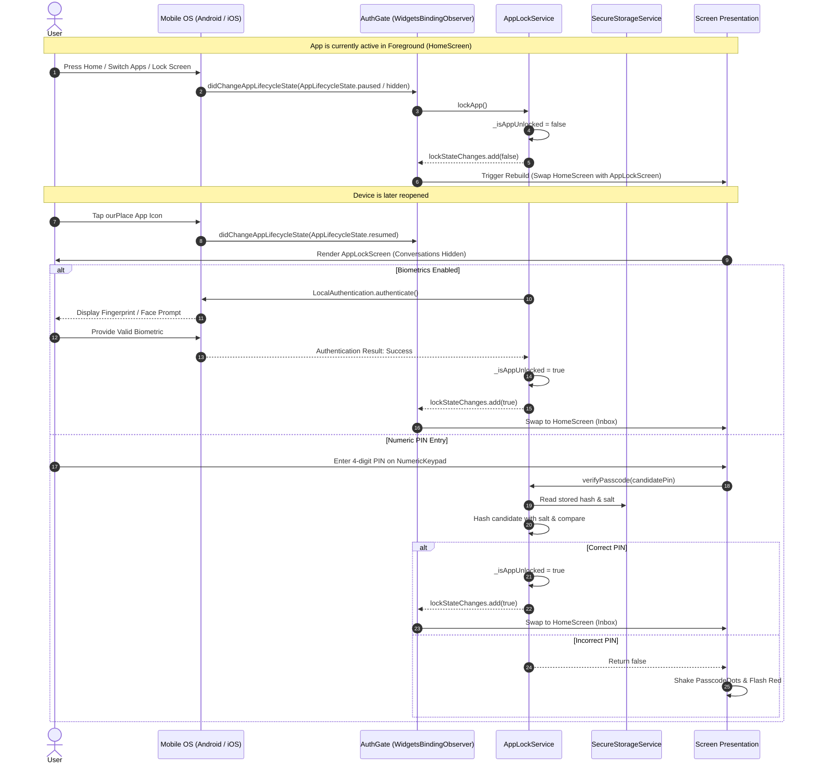

---

## 5. Clean Architecture Layer Dependencies

The codebase follows Clean Architecture with unidirectional dependencies:

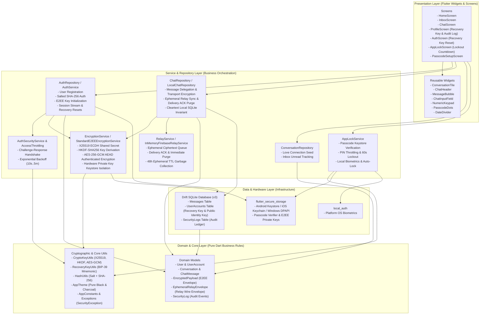

---

## 6. End-to-End Encryption & Ephemeral Relay Protocol

Implemented in **Phase 10** (X25519 ECDH + HKDF-SHA256 + AES-256-GCM authenticated payload encryption & tamper detection) and **Phase 11** (Temporary Firebase Relay with Delivery ACK Purge), this protocol guarantees zero-knowledge message delivery with no permanent server footprint:


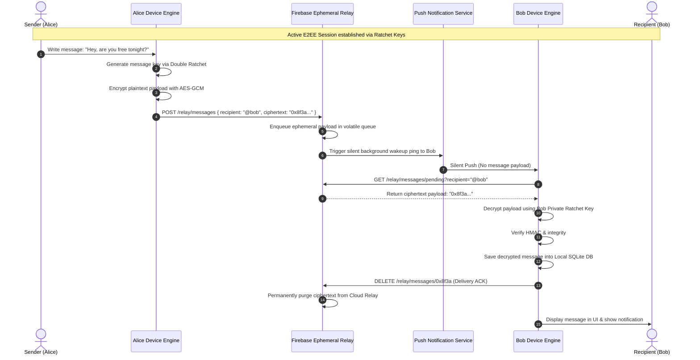

---

## 7. Multi-User Navigation & Screen Hierarchy

The application navigation routes between multiple conversation partners while elevating the Love Connection:

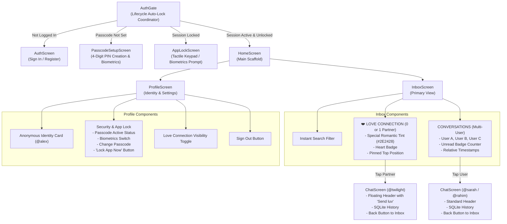

---

## 8. Love Connection & One-Time Love Code Sharing Flow

In **Phase 17**, users can selectively grant their partner access to view a specific conversation thread using an ephemeral 60-second authorization code:

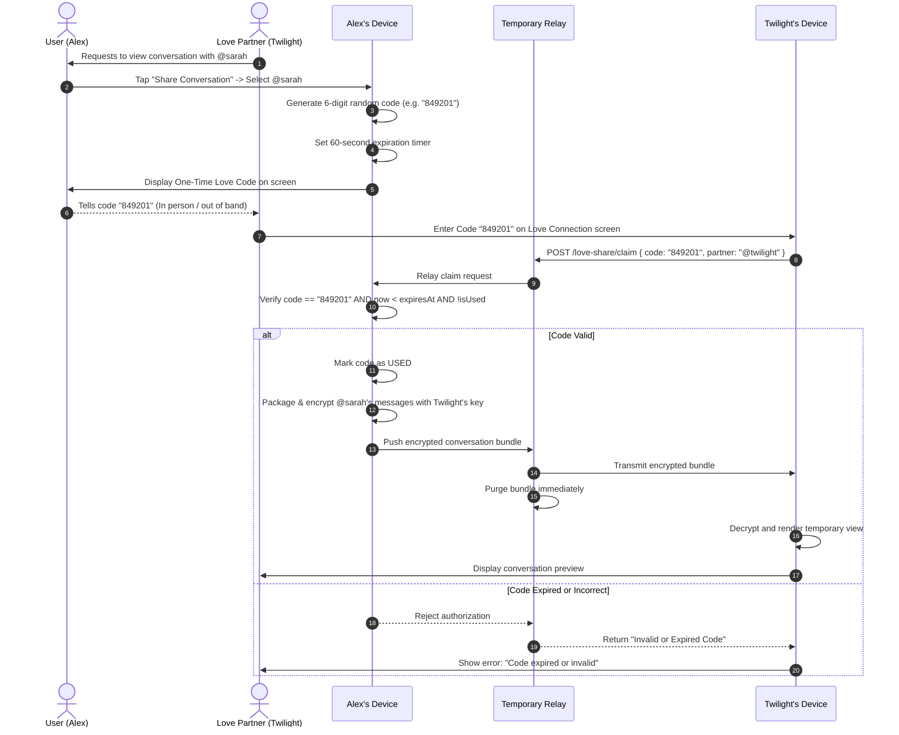

---

## 9. Local Database Schema & Entity Relationships

The local Drift SQLite database (Schema Version 3) enforces local persistence for accounts, chat messages, and device security logs:

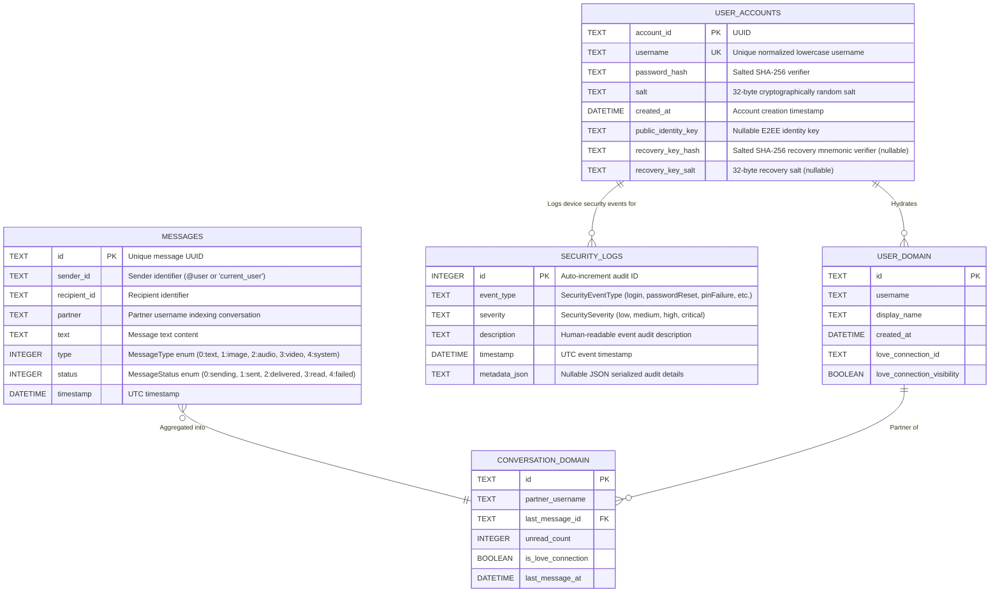

---

## 10. Security Enclave & Cryptographic Trust Boundaries

Physical and network security boundaries ensure zero data leakage and zero cloud telemetry:

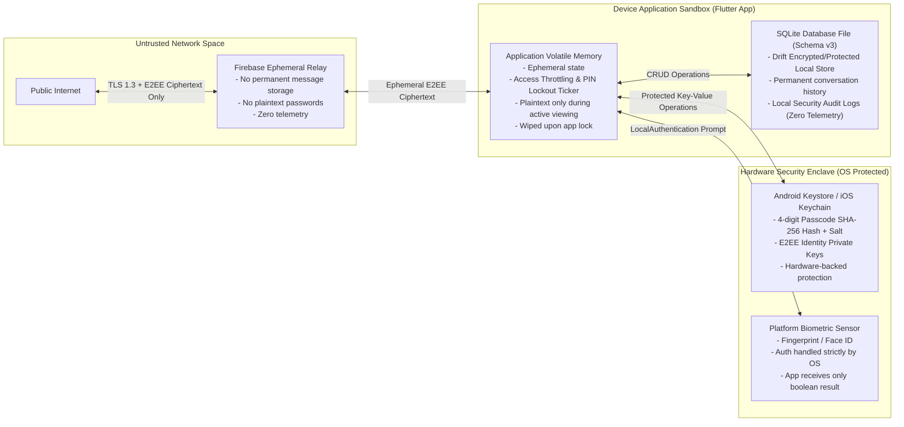

---

## 11. Message State Lifecycle & Synchronization Flow

### 11.1. Monotonic Unidirectional State Machine
Messages follow a strictly monotonic forward lifecycle. No regression is permitted, and `read` status is terminal.

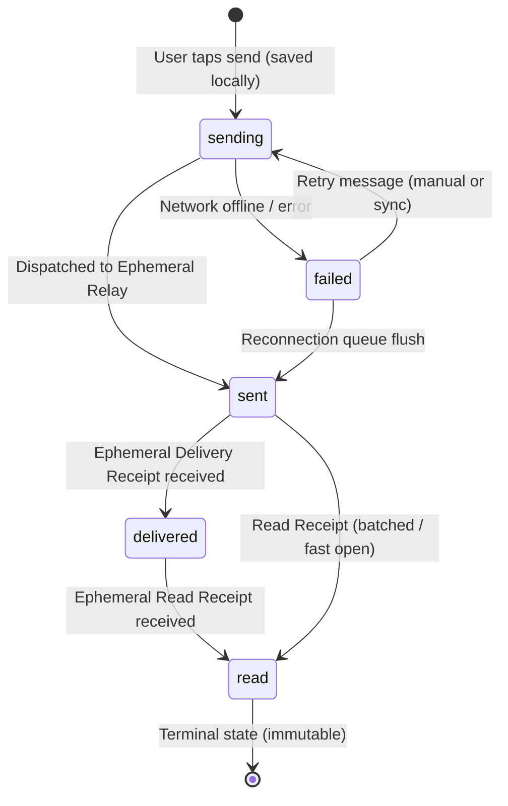

### 11.2. Offline Queueing and Reconnection Sequence
When offline, outbound messages are persisted in local SQLite with `failed` status. When network connectivity resumes, `flushOutboundQueue` drains all unsent messages to the relay.

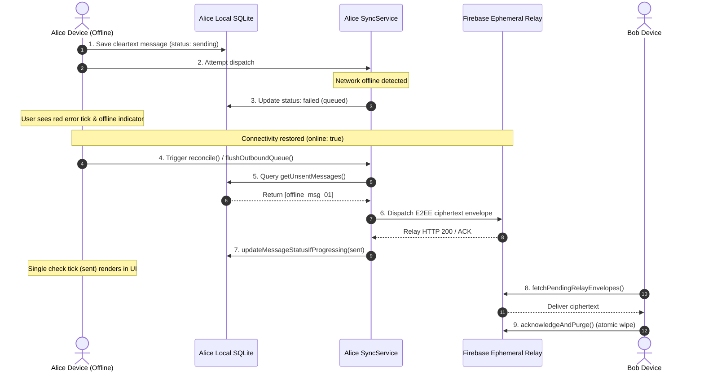

### 11.3. End-to-End Delivery & Read Receipt Flow
Receipts are transmitted as ephemeral wire envelopes through the relay and purged immediately upon receipt.

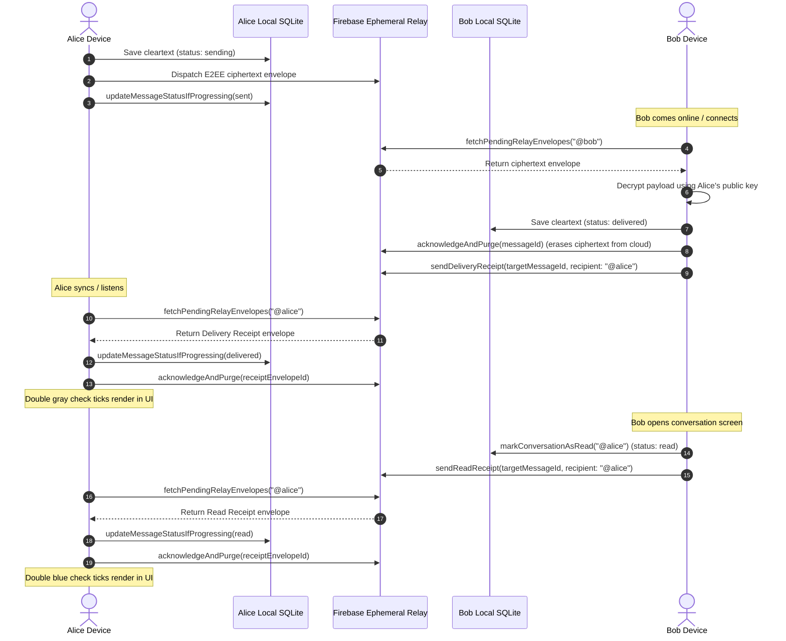

